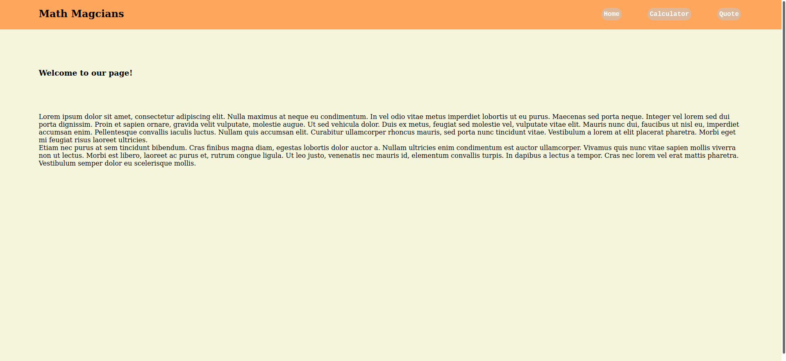

# Todo-app
* This project was created using React, it renders functional components, it routes between paths so it can be displayed as a single page application. The Calculator App is a single page aplication that has 3 page components routed by the main app component, one of the components runs a react component calculator.



## Built With

- Html, Javascript, CSS
- Webpack
- React JS
- Developed in VSCode

## Live Demo

[Heroku Live Demo Link](https://vast-chamber-50810.herokuapp.com/)

[Netlify Live Demo Link](https://unruffled-mcnulty-aa9613.netlify.app)

## Setup 
### clone repository
```bash
$ git clone <git@github.com:JbirdL86/react-todo-app.git>
```
### Start Project
```bash
$ cd react-todo-app 
-Install node_modules
-run yarn
$ yarn start
```

### Author 🤝:
* Juan Luis Gonzalez 
- Github: [@githubhandle](https://github.com/JbirdL86)
- Twitter: [@twitterhandle](https://twitter.com/JuanLui06498455)
- Linkedin: [linkedin](https://www.linkedin.com/in/juan-luis-0551921aa/)

## 🤝 Contributing

Contributions, issues, and feature requests are welcome!

Feel free to check the issues page. [issues page](https://github.com/JbirdL86/sp-math-magicians/issues).

## Show your support

Give a ⭐️ if you like this project!

## 📝 License

This project is [MIT](./MIT.md) licensed.